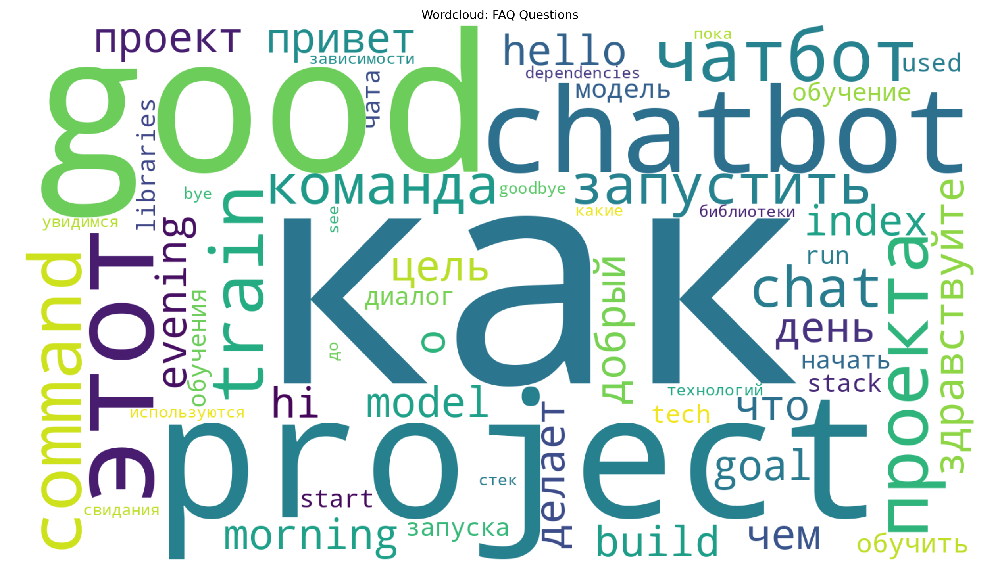
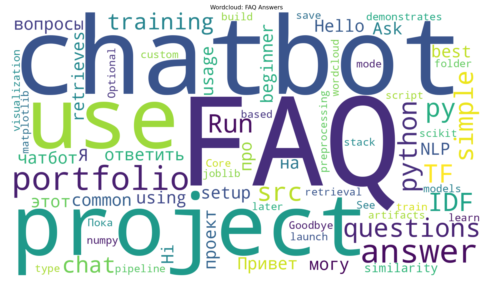
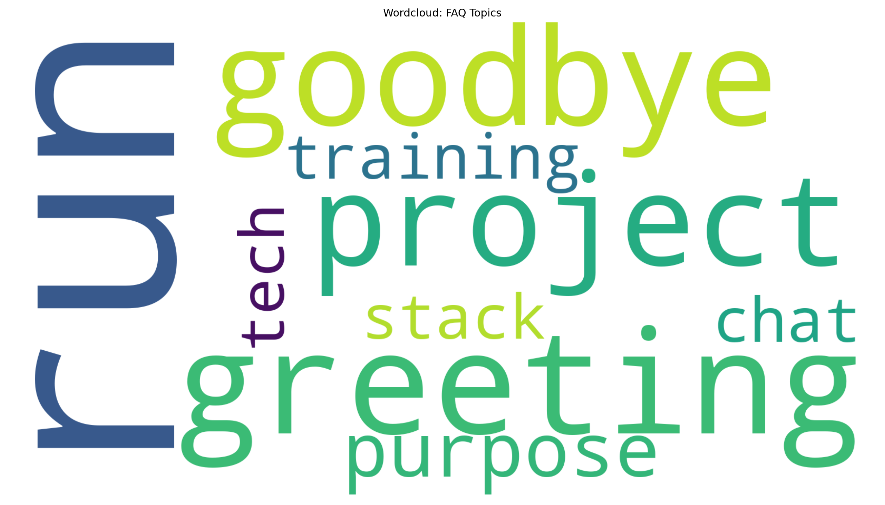
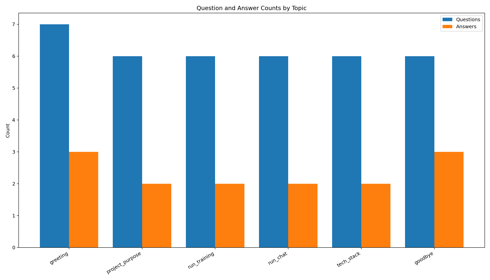
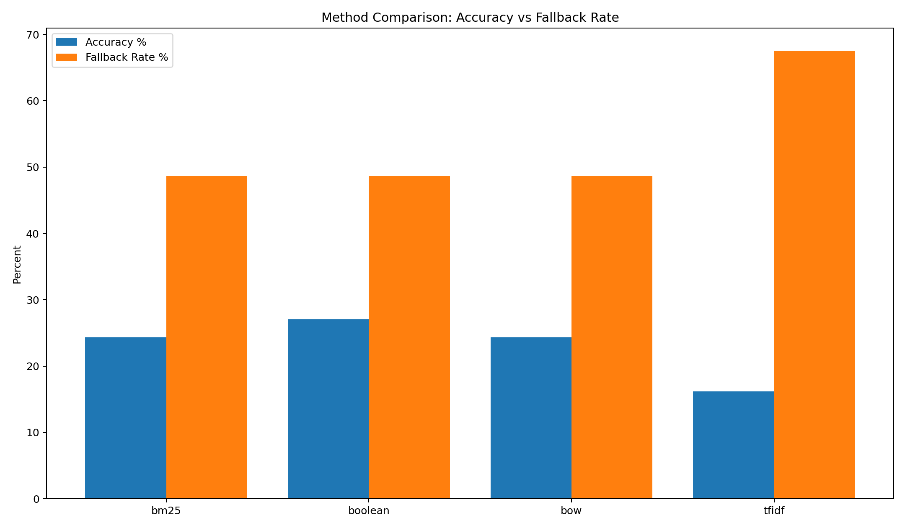

# FAQ Chatbot (Beginner NLP Portfolio Project)

Quick publishing assets:
- Demo walkthrough: `DEMO_SCRIPT.md`
- GitHub description text: `GITHUB_DESCRIPTION.md`

Simple retrieval-based FAQ chatbot with 4 methods:
- TF-IDF
- Bag of Words (BoW)
- BM25
- Boolean matching

This MVP supports **English + Russian** questions and uses a fixed fallback message for unknown queries.

## Project Structure


```text
faq_chatbot-beginner/
├── data/
│   ├── intents.json
│   ├── web_faq.csv
│   └── topics/
│       ├── food.csv
│       ├── health.csv
│       ├── news.csv
│       ├── politics.csv
│       ├── sports.csv
│       ├── technology.csv
│       └── weather.csv
├── models/
│   ├── faq_index.joblib
│   ├── faq_index_bm25.joblib
│   ├── faq_index_boolean.joblib
│   ├── faq_index_bow.joblib
│   └── faq_index_tfidf.joblib
├── results/
│   ├── eval_metrics.csv
│   ├── smoke_eval.csv
│   └── plots/
├── src/
│   ├── chat.py
│   ├── evaluate.py
│   ├── smoke_test.py
│   ├── train.py
│   ├── utils.py
│   └── visualize.py
├── DEMO_SCRIPT.md
├── GITHUB_DESCRIPTION.md
├── README.md
└── requirements.txt
```


## 1) Install dependencies

```bash
pip install -r requirements.txt
```

## 2) Train index

```bash
python src/train.py
```

Default method is `tfidf`.
By default, training also reads extra Q/A rows from:
- `data/web_faq.csv`
- `data/topics/*.csv`

To train other methods:

```bash
python src/train.py --method bow
python src/train.py --method bm25
python src/train.py --method boolean
```

Train with custom CSV source paths (file(s) or folder(s)):

```bash
python src/train.py --method tfidf --qa-sources data/web_faq.csv data/topics
```

Each method saves its own artifact in `models/`:
- `faq_index_tfidf.joblib`
- `faq_index_bow.joblib`
- `faq_index_bm25.joblib`
- `faq_index_boolean.joblib`

## 3) Run chatbot

```bash
python src/chat.py --method tfidf
```

You can also run:

```bash
python src/chat.py --method bow
python src/chat.py --method bm25
python src/chat.py --method boolean
```

Type your question, and type `quit` to exit.

If a matched answer comes from `data/web_faq.csv`, chat also prints its source URL.

Terminal UI commands:
- `/help` show command list
- `/topics` show available topic names
- `/topic <name>` switch active topic filter
- `/topic all` use all topics
- `/list` show available topics and sample questions
- `/clear` clear terminal and redraw header
- `/quit` exit chat

## 4) Evaluate methods

Evaluate all methods:

```bash
python src/evaluate.py --method all
```

Evaluate one method:

```bash
python src/evaluate.py --method tfidf
```

Export results to CSV for portfolio charts:

```bash
python src/evaluate.py --method all --out results/eval_metrics.csv
```

Output columns:
- `Total`: number of evaluated patterns
- `Correct`: top-1 matches with same intent tag (leave-one-pattern-out)
- `Accuracy`: `Correct / Total`
- `FallbackRate`: how often score was below threshold

## 4.1) Quick smoke test

```bash
python src/smoke_test.py
```

This checks:
- model artifact exists
- chatbot returns answer + score
- popular topics are loaded
- evaluation CSV output format is valid

## 5) Build visualizations (Wordcloud + Topic charts)

Generate all images:

```bash
python src/visualize.py --eval-csv results/eval_metrics.csv --out-dir results/plots
```

Generated files:
- `results/plots/wordcloud_questions.png`
- `results/plots/wordcloud_answers.png`
- `results/plots/wordcloud_topics.png`
- `results/plots/topic_question_answer_counts.png`
- `results/plots/evaluation_comparison.png`

## 5.1) Regenerate ignored artifacts after clone

Model binaries and plot images are intentionally ignored in Git to keep the repository lightweight.

Run this sequence after cloning:

```bash
python src/train.py --method tfidf
python src/train.py --method bow
python src/train.py --method bm25
python src/train.py --method boolean
python src/evaluate.py --method all --out results/eval_metrics.csv
python src/visualize.py --eval-csv results/eval_metrics.csv --out-dir results/plots
```

## 6) Visualization preview

| Preview | Image |
|---|---|
| Wordcloud: Questions |  |
| Wordcloud: Answers |  |
| Wordcloud: Topics |  |
| Topic counts (Questions vs Answers) |  |
| Method comparison (Accuracy vs Fallback) |  |

## 7) Current results snapshot

Latest method comparison is saved in `results/eval_metrics.csv`.

Example highlights:
- Best accuracy in current run: BM25 (~27.05%)
- Next best: BoW (~21.31%), then Boolean (~17.21%)
- TF-IDF remains a simple baseline but with highest fallback rate on this expanded dataset

Recompute anytime:

```bash
python src/evaluate.py --method all --out results/eval_metrics.csv
```

## Data format (`data/intents.json`)

Each intent has:
- `tag`: intent name
- `patterns`: example user questions
- `responses`: possible bot replies

Example:

```json
{
	"tag": "run_training",
	"patterns": ["how to train model", "как обучить модель"],
	"responses": ["Run: python src/train.py"]
}
```

## Data format (`data/web_faq.csv`)

CSV headers:
- `question`
- `answer`
- `topic`
- `source_url`

Each row becomes one retrievable Q/A item for chatbot responses.

Popular topics are stored in `data/topics/` (sports, weather, food, politics, news, technology, health).

## Data sources

Web-derived Q/A rows are curated from public documentation pages and summarized into dataset rows:
- Python FAQ: https://docs.python.org/3/faq/general.html
- Python Programming FAQ: https://docs.python.org/3/faq/programming.html
- Git FAQ: https://git-scm.com/docs/gitfaq

`source_url` in CSV is shown in terminal chat when available.

## How this works

1. Normalize user text (tokenize + remove simple stopwords).
2. Score query against all patterns using selected retrieval method.
3. Choose best-scoring intent pattern.
4. Return response if score >= threshold, else fallback.

## Next improvements

- Add evaluation metrics (Top-1 accuracy / recall@k).
- Add optional wordcloud generation from FAQ corpus.

## Portfolio checklist

- [x] End-to-end train -> chat -> evaluate -> visualize pipeline
- [x] Multiple retrieval methods (TF-IDF, BoW, BM25, Boolean)
- [x] Real-life topic datasets via CSV files
- [x] Terminal UI with topic selection and command help
- [x] Data source attribution for web-derived rows
- [ ] Add short demo GIF/video for README

